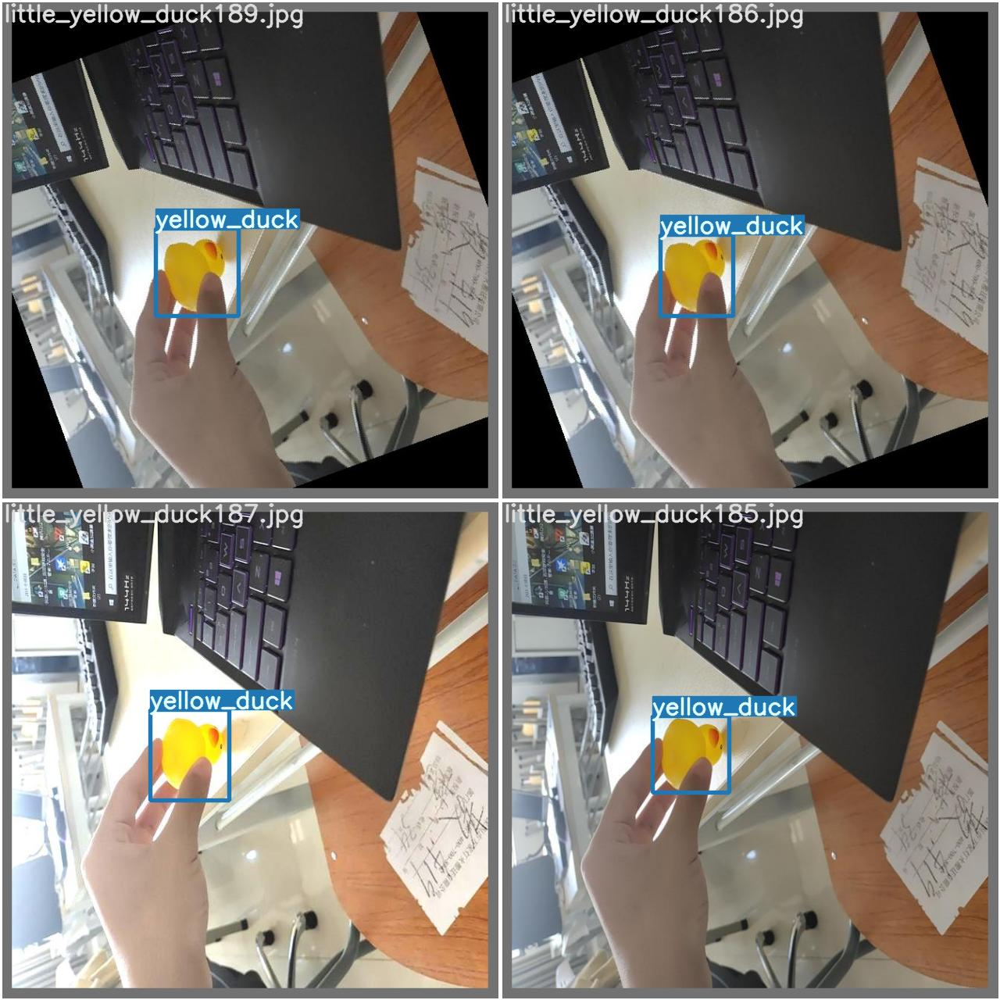
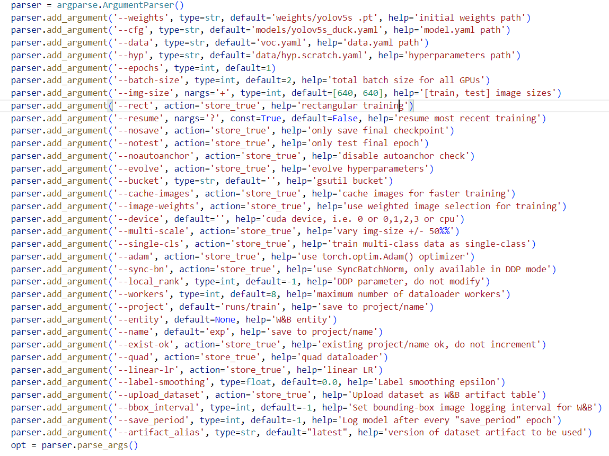

# Identify-yellow-duck
## 1.项目简介
## Identify-yellow-duck是一个基于yolov5实现识别物体的项目
## 2.功能简述
### 此版本功能包含了识别物体和项目的一下特色
## 识别物体:
- 识别照片中的小黄鸭
- 通过摄像头识别物体小黄鸭
## 项目特色
- 速度快:此项目使用了yolov5算法,每个图像的推理时间最快0.007秒
- 占用空间小:总文件大小只有25m
## 3.主要功能
### 识别小黄鸭
## 4.项目开发过程
### 通过在项目中train.py文件中添加参数一下参数
## 4.项目总结
### 在本次项目中初步认识AI的项目流程,了解yolov5算法的功能以及优点,也认知到自身水平的不足,在编程此项目时查阅许多资料来完善,重新认识了python语言的强大,但我会把这次项目所获取的经验用于下一次项目开发，争取做到下一个项目自己完善
